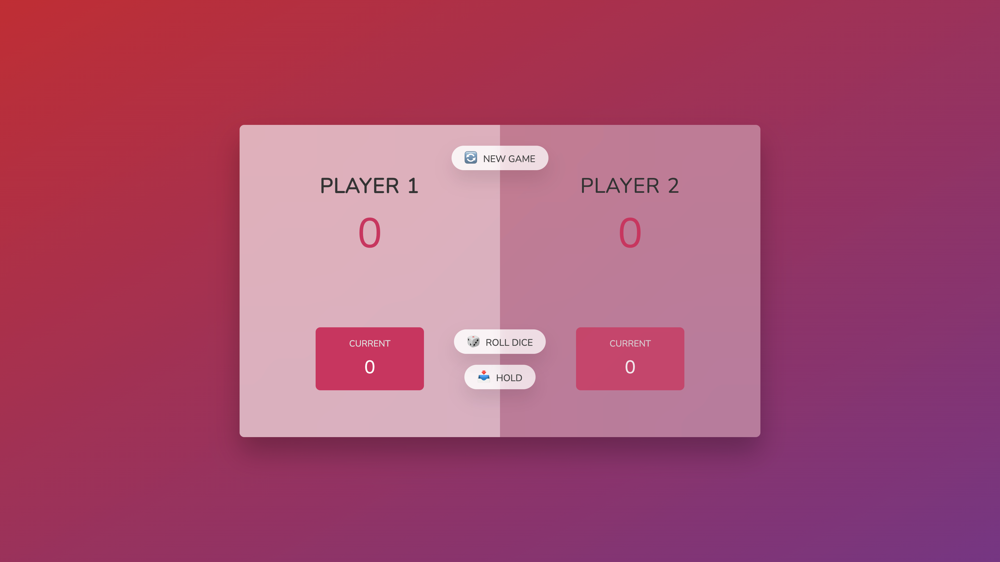

🎲 The Hold Zone Game

Welcome to the **The Hold Zone Game** — a simple, interactive two-player dice game built using **HTML, CSS, and JavaScript**. This game helps you practice DOM manipulation, event handling, game logic, and the use of state variables in JavaScript.

---

## 📸 **Screenshots**

A quick glimpse of the game in action.

## 

---

🧠 Game Rules

- Two players take turns to roll a dice.
- On each roll:
  - If the number is **not 1**, it gets **added to the current score**.
  - If the number is **1**, the player **loses all current score**, and the **turn passes to the next player**.
- A player can **"Hold"** to add their current score to their total score and pass the turn.
- The first player to reach **100 points** wins the game.

---

🛠️ Tech Stack

- **HTML** for structure
- **CSS** for styling
- **Vanilla JavaScript** for functionality

---

✨ Features Implemented

- ✅ Dice generation using `Math.random()`
- ✅ Dynamic score updates based on dice rolls
- ✅ Switching turns between two players
- ✅ Game ends when a player hits 20 or more
- ✅ Reset functionality using the "New Game" button
- ✅ Visual cues for active player and winner

---

📁 Project Structure---

🔄 Reset Functionality

Click the **"New Game"** button at any time to reset:

- All scores
- Dice visibility
- Player highlighting

---

🚀 How to Run the Game Locally

1. Clone this repository or download the project.
2. Make sure all `dice` images are in the `/imgs/` folder.
3. Open `index.html` in your browser.
4. Play the game and enjoy!

---

📝 Notes

This game is great for learning:

- State management in JavaScript
- Working with the DOM
- Handling user interaction
- Implementing game logic and UI feedback

---

📌 Author

Sheharyar Ahmed  
Full Stack Developer in Progress 💻 | JS Enthusiast | Portfolio Project

---
